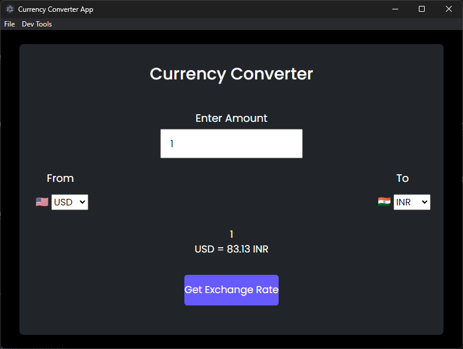

# Currency Converter App

This is a simple currency converter app built with Electron and JavaScript. It allows you to convert between different currencies and get the latest exchange rates.



### Features

* Convert between any two currencies
* Get the latest exchange rates
* Simple and easy to use interface

### Prerequisites

To run this app, you will need to have Node.js and Electron installed on your computer. You can download Node.js from [here](https://nodejs.org/en/) and Electron from [here](https://electronjs.org/).

### Installation

Once you have Node.js and Electron installed, you can clone this repository and install the dependencies by running the following commands:

```
git clone https://github.com/kaustubh_vasagadekar/currency-convert-app.git
cd currency-convert-app
npm install
```

### Usage

To run the app, simply run the following command:

```
npm start
```

The app will then open in a new window. You can then select the currencies you want to convert between and enter the amount you want to convert. The app will then show you the exchange rate and the converted amount.

### Code Explanation

The code for this app is relatively simple. The main file is `index.js`. This file contains the code that creates the Electron window and loads the HTML file. The HTML file contains the code that creates the user interface.

The JavaScript code in the HTML file uses the `fetch()` function to get the latest exchange rates from an API. The code then uses the exchange rates to convert the amount entered by the user.

The CSS code in the HTML file styles the user interface.

### Conclusion

This is a simple but useful app that can be used to convert between different currencies. It is easy to use and can be run on any platform that supports Electron.
```

